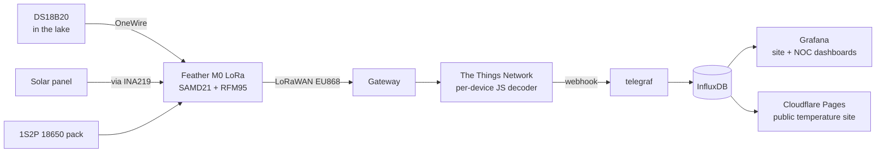

# gisebo — solar LoRaWAN water-temperature station

A battery + solar powered lake-water temperature sensor built on an Adafruit
Feather M0 LoRa (SAMD21 + RFM95), reporting over The Things Network (EU868)
into a telegraf → InfluxDB → Grafana backend. One firmware image serves every
board; the deployed unit (**gisebo-05**) sits at a lake in Sweden, submerged
sensor, south-facing panel, sealed box with a magnet-operated field reset.

Measured, not estimated: the station's deep-sleep night costs **~0.1 mV/h** of
battery (a full pack alone lasts months), the solar charge path is hard-clamped
at ~116 mA, and every threshold in the energy policy is derived from fleet
telemetry rather than guessed.

## Why this project is interesting

- **Everything with judgement is host-tested.** The firmware is a thin Arduino
  glue layer (`.ino`) over pure-logic headers (season machine, power policy,
  solar signal, payloads, diagnostics, persistence) that compile and run as
  ordinary C++ on the host — hundreds of assertions, no hardware needed. The
  TTN payload decoder is tested **against production truth**: live captured
  uplinks with TTN's own decoded output as the expected values.
- **Field-debuggable with no USB.** A dedicated diagnostics uplink reports a
  dead sensor (with failure *flavour*: not found / CRC / stuck-85 / out of
  range), the sensor's ROM identity (swap detection), consecutive-failure
  streaks, reset causes, probe results and battery — rate-limited by design
  (one frame per boot, prompt on new faults, daily re-alerts, one "all clear"
  when faults empty). A real chain failure on the predecessor unit was
  diagnosed over the air in a single boot.
- **A two-gate adaptive reporting policy.** Reporting cadence follows water
  temperature (seasonal base) and battery bands, with a solar bonus that
  engages only when a sun-presence EWMA latches **and** the pack is healthy —
  so sunshine can never talk a struggling battery into spending more. The
  overnight EWMA decay has been verified against its 24 h time constant to
  within the wire quantum, three nights running.
- **Build provenance on the wire.** Release images are produced only by
  [`scripts/build.sh`](scripts/build.sh) (tests → clean-tree check → compile),
  which stamps the git commit into the binary; the device reports it back over
  LoRa (`fw_commit`), so "which firmware is this unit actually running?" is
  answered from the wire. Ad-hoc builds mark themselves as unofficial.
- **One binary, every board.** OTAA keys are derived at boot from the SAMD21
  silicon serial (no per-board key files to mis-flash), and a runtime I2C probe
  for the INA219 selects the primary-cell or solar policy.
- **Verified in production, with receipts.** Every feature lands with a dated
  dev-note and is flash-verified against captured uplinks (the
  [`ttn-captures/`](ttn-captures/) directory is the evidence trail). The
  water-plausibility check's first-ever live alert was the deployment itself —
  it detected its own submersion.

## System overview



## Hardware

Full wiring reference with the pad-by-pad table:
[`docs/hardware/README.md`](docs/hardware/README.md).

```
  SOLAR CHARGE PATH                          BATTERY / STORAGE
  =================                          =================
  PANEL(+) ──▶|── INA219 Vin+ ▸ Vin− ──┐     18650 ×2 (∥, 3.7 V) ── PCM 1S ──┐
         Schottky   (measures harvest) │      + supercap across the pack     │
  PANEL(−) ── GND                      │                                     │
                                       ▼                                     ▼
                              ┌─────────────────────────────────────────────────┐
                              │  FEATHER M0 LoRa    USB ◂ charge in             │
                              │  MCP73831 charger   JST ◂ pack                  │
  DS18B20 ── DATA ──────────▶ │  A2   (+ 4.7 kΩ pull-up to 3V)                  │
  (water)    VDD/GND ── 3V/GND│  SDA/SCL ◂ INA219 logic (addr 0x40)             │
                              │  6 ◂── DIO1 jumper (LMIC requires it)           │
                              │  11 ◂─ mode strap: float = PROD, GND = DEV      │
  reed switch (NO) ─────────▶ │  EN ↔ GND: magnet through the case = hard reset │
                              └─────────────────────────────────────────────────┘
```

Key hardware decisions, each documented:

| topic | doc |
|---|---|
| Wiring, strap semantics, sample TTN frames | [`docs/hardware/README.md`](docs/hardware/README.md) |
| Panel azimuth/tilt vs. obstructions (measured + modelled) | [`docs/panel-placement-guidance.md`](docs/panel-placement-guidance.md) |
| Every INA219 register value this firmware can observe | [`docs/ina219-register-reference.md`](docs/ina219-register-reference.md) |
| Why `harvest_mah` is indicative and battery *trend* is the real metric | [`docs/solar-input-measurement-research.md`](docs/solar-input-measurement-research.md) |
| OTAA keys derived from the silicon serial | [`docs/generate-keys-from-feather-serial.md`](docs/generate-keys-from-feather-serial.md) |

## Firmware architecture

Two-phase flow, no application-level OS jobs: **commissioning** (join loop) and
**operational** (wake → read → buffer → uplink when due → deep sleep). The
`.ino` holds the Arduino glue; the judgement lives in host-tested headers:

| header | what |
|---|---|
| [`season.h`](season.h) | seasonal baseline from water temperature, 1 °C hysteresis |
| [`power_policy.h`](power_policy.h) | `PowerPolicy` interface + voltage-band hysteresis |
| [`policy_primary.h`](policy_primary.h) / [`policy_solar.h`](policy_solar.h) | the two variants' bands and interval ladders |
| [`solar_signal.h`](solar_signal.h) | sun-presence EWMA, bonus latch, harvest accumulator |
| [`payload.h`](payload.h) | wire encoders and sentinels |
| [`uplink_schedule.h`](uplink_schedule.h) | send decision + uplink counter |
| [`persist.h`](persist.h) | `.noinit` RAM state: magic + version + CRC |
| [`diagnostics.h`](diagnostics.h) | fault frames, DS18B20 status codes, verbose DEV frame |
| [`sensor_plausibility.h`](sensor_plausibility.h) | water-step plausibility (thresholds from fleet data) |
| [`variant_probe.h`](variant_probe.h) | INA219 probe → variant selection (warm-reset safe) |
| [`ina219_bus.h`](ina219_bus.h) | CNVR/OVF status-flag handling |
| [`keygen.h`](keygen.h) | credentials from the silicon serial |

Design rules with their rationale (no `delay()` near the radio, duty-cycle
respect, the region trap, clock-sampling in busy-waits, …) are maintained in
[`CLAUDE.md`](CLAUDE.md). The solar variant's full design and rejected
alternatives: [`docs/solar-variant-design.md`](docs/solar-variant-design.md).

## Protocol (v7)

Mode comes from the FPort, never from a payload byte:

| purpose | PROD | DEV | size |
|---|---|---|---|
| data (primary variant) | 10 | 20 | 9 B |
| data (solar variant) | 11 | 21 | 15 B |
| fault / health | 1 | 2 | 16 B (schema 2) |
| verbose full-state (DEV only) | — | 3 | 37 B (schema 3, carries `fw_commit`) |

Decoders are per-device and live in [`decoders/`](decoders/) — uploaded
byte-identical to TTN and tested by [`test/run_v7.js`](test/run_v7.js) against
live fixtures. Migration story: [`docs/release-v7-migration.md`](docs/release-v7-migration.md).

## Build, test, verify

```
./scripts/setup-toolchain.sh   # one-time: arduino-cli, cores, libs, region config
./scripts/build.sh             # release: host tests + decoder tests + clean-tree
                               # check + commit-stamped image
npm test                       # decoder suites alone
(cd test/host && ./run_tests.sh)   # firmware logic suites alone
```

A standalone DS18B20 bench diagnostic (bus electrics, conversion timing,
EEPROM, soak and wiggle tests — no LoRa) lives in
[`tools/ds18b20-diag/`](tools/ds18b20-diag/).

## Backend

- telegraf config (v7 vocabulary, `f_port` tag, radio metrics):
  [`backend/telegraf.conf`](backend/telegraf.conf)
- Grafana dashboards, versioned as JSON: [`backend/grafana/`](backend/grafana/)
  — the public site dashboard and a NOC-style operations dashboard (status
  tiles, submersion detector, battery bands, reboot detector, fault state with
  honest staleness semantics)
- Alarm specifications awaiting deployment:
  [`docs/backend-monitoring.md`](docs/backend-monitoring.md)

## Documentation map

| where | what |
|---|---|
| [`CLAUDE.md`](CLAUDE.md) | the living engineering handbook: design rules, fleet, protocol, conventions |
| [`docs/dev-notes/`](docs/dev-notes/) | one dated note per non-trivial change — summary, rationale, verification (40+ and counting) |
| [`TODO.md`](TODO.md) / [`TODO-summarized.md`](TODO-summarized.md) | work items with full context; the summarized twin is one line per item |
| [`docs/sprints/`](docs/sprints/) | the sprint plan the work is tracked against |
| [`ttn-captures/`](ttn-captures/) | raw captured uplinks — the verification evidence for every flash-verified claim |
| [`__doc/code_reviews/`](__doc/code_reviews/) | dated code-review reports |
| [`docs/multi-sensor-v4-analysis.md`](docs/multi-sensor-v4-analysis.md) | what v3 must do so multi-sensor v4 stays cheap |
| [`docs/rp2040-lora-port-feasibility.md`](docs/rp2040-lora-port-feasibility.md) | why a second hardware platform was assessed and declined |
| [`docs/deployment-checklist-gisebo-05.md`](docs/deployment-checklist-gisebo-05.md) | the deployment-day checklist, as executed |

> Note: `docs/test-payloads.md` documents the retired 8-byte v5 payload and is
> kept as history — do not validate against it.
